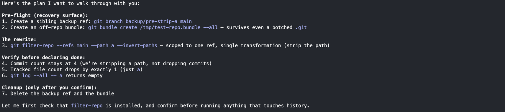

# git-history-rewrite

Safety net for destructive git operations — `git filter-repo`,
`git push --force`, and `git reset --hard`. Bundles a `PreToolUse` hook
that blocks unsafe forms and a skill body that steers the agent through
the discipline items the hook can't enforce mechanically.


## Install

Claude Code:
```
claude plugin marketplace add glebmish/builder-toolkit
claude plugin install git-history-rewrite@builder-toolkit
```

Standalone skill (skill body only, no hook):
```
npx skills add glebmish/builder-toolkit --skill git-history-rewrite
```

**Prerequisites**

`jq` on `PATH` — the PreToolUse hook parses tool-input JSON with it. Only
required for the plugin install path.


## Blocked commands → safe form

| Blocked | Safe form |
|---------|-----------|
| `git filter-branch` | `git filter-repo` (`--analyze` exempt) |
| `git filter-repo` | add `--refs <ref>` |
| `git push --force` | add `--force-with-lease --force-if-includes` |
| `git reset --hard` (no target) | pass an explicit target |
| `git reset --hard HEAD~N` (relative) | resolve with `git rev-parse`, pass the SHA |
| `git reset --hard <non-HEAD>` with dirty tracked tree | clean the tree |
| `git reset --hard <target>` that orphans commits | create a backup ref first |

## Agent-enforced



- Sibling backup ref before any rewrite (`git branch backup/pre-<topic> HEAD`).
- Off-repo bundle before `filter-repo` (`git bundle create /tmp/<repo>.bundle --all`).
- Post-rewrite verification: commit count, file count, tests/typecheck/build at HEAD and at each amended commit.
- Cleanup only after explicit user acceptance.
- Authorization is exact — ask before extending scope.
- Smallest tool that does the job (`rebase --onto` before `filter-repo`).

## Hook steps

1. Pre-filter: exit 0 if input has no `git` substring.
2. Extract `.tool_input.command` via `jq`.
3. Walk leading `KEY=val` and `cd <path>` prefixes, `chdir` into each.
4. Find every `git` token at a word boundary; strip global options.
5. Dispatch to per-subcommand gate (`filter-repo`, `filter-branch`, `push`, `reset`). Block → exit 2; else exit 0.
